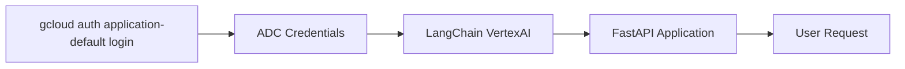

# 🚀 Simple FastAPI with LangChain Agent using ADC (Application Default Credentials)

Here's the **simplest way** to create a FastAPI with LangChain Agent using Vertex AI with ADC authentication.

## 📋 Quick Setup

### Step 1: Install gcloud CLI and Setup ADC
```bash
# Install gcloud CLI (if not already installed)
# Then authenticate with ADC
gcloud auth application-default login
```

This single command sets up Application Default Credentials for your local development.

### Step 2: Install Required Packages
```bash
pip install fastapi uvicorn langchain langchain-google-vertexai
pip install fastapi uvicorn langchain langchain-google-vertexai langchain-core
```

### Step 3: Create `main.py` (Complete Code)
```python
from fastapi import FastAPI
from langchain_google_vertexai import ChatVertexAI
from langchain.agents import AgentExecutor, create_tool_calling_agent
from langchain_core.tools import tool
from langchain_core.prompts import ChatPromptTemplate

# Initialize FastAPI
app = FastAPI(title="Simple LangChain Agent API")

# Initialize Vertex AI Model - Uses ADC automatically
llm = ChatVertexAI(model_name="gemini-1.5-flash")

# Define a simple tool
@tool
def calculate(expression: str) -> str:
    """Calculate mathematical expression"""
    try:
        return str(eval(expression))
    except:
        return "Invalid expression"

# Create agent
tools = [calculate]
prompt = ChatPromptTemplate.from_messages([
    ("system", "You are a helpful assistant."),
    ("human", "{input}"),
    ("placeholder", "{agent_scratchpad}"),
])
agent = create_tool_calling_agent(llm, tools, prompt)
agent_executor = AgentExecutor(agent=agent, tools=tools)

# API Endpoints
@app.get("/")
def root():
    return {"message": "API is running. Use /docs for interactive documentation."}

@app.post("/ask")
async def ask_question(question: str):
    """Ask the agent a question"""
    result = agent_executor.invoke({"input": question})
    return {"answer": result["output"]}
```

### Step 4: Run the API
```bash
uvicorn main:app --reload
```

### Step 5: Test the API
Visit `http://localhost:8000/docs` and test with:
- `What is 25 * 4 + 10?`
- `Calculate 100 / 5`

## 🔧 How ADC Works



## 📊 Comparison: ADC vs Service Account Key

| Method | Setup Difficulty | Security | Best For |
|--------|-----------------|----------|----------|
| **ADC** |  |  | Local Development |
| **Service Account Key** |  |  | Production/Containerized |

## ⚙️ Production Considerations

<details>
<summary>🔧 ADC in Different Environments</summary>

### Local Development
```bash
gcloud auth application-default login
```

### Google Cloud Services (Cloud Run, Cloud Functions, GKE)
ADC automatically uses the attached service account .

### Other Cloud Providers/On-Premises
Set `GOOGLE_APPLICATION_CREDENTIALS` environment variable:
```bash
export GOOGLE_APPLICATION_CREDENTIALS="/path/to/service-account.json"
```

</details>

## 🚨 Troubleshooting

<details>
<summary>❓ Common Issues</summary>

### Issue 1: "Could not automatically determine credentials"
**Solution**: Run `gcloud auth application-default login` 

### Issue 2: Permission denied
**Solution**: Ensure your account has `Vertex AI User` role :
```bash
gcloud projects add-iam-policy-binding YOUR_PROJECT_ID \
  --member="user:YOUR_EMAIL" --role="roles/aiplatform.user"
```

### Issue 3: Model not found
**Solution**: Verify the Vertex AI API is enabled :
```bash
gcloud services enable aiplatform.googleapis.com
```

</details>

## 🎯 Key Benefits of ADC

1. **No Service Account Management**: Uses your personal credentials
2. **Automatic Rotation**: No need to rotate keys
3. **Simplified Setup**: One command vs. file management
4. **Better Security**: No sensitive files in your project

## 📈 Next Steps

1. **Add More Tools**: Integrate with external APIs
2. **Add Memory**: Implement conversation history
3. **Deploy**: Use Cloud Run for production

## 🔗 Additional Resources

| Resource | Description |
|----------|-------------|
| [ADC Documentation](https://cloud.google.com/docs/authentication/provide-credentials-adc)  | Official ADC setup guide |
| [Vertex AI Authentication](https://cloud.google.com/vertex-ai/docs/authentication)  | Vertex AI auth methods |
| [LangChain Vertex AI Integration](https://docs.langchain.com/oss/python/integrations/llms/google_vertex_ai) | LangChain documentation |

This approach uses **ADC (Application Default Credentials)** which is simpler and more secure than managing service account keys for local development .
